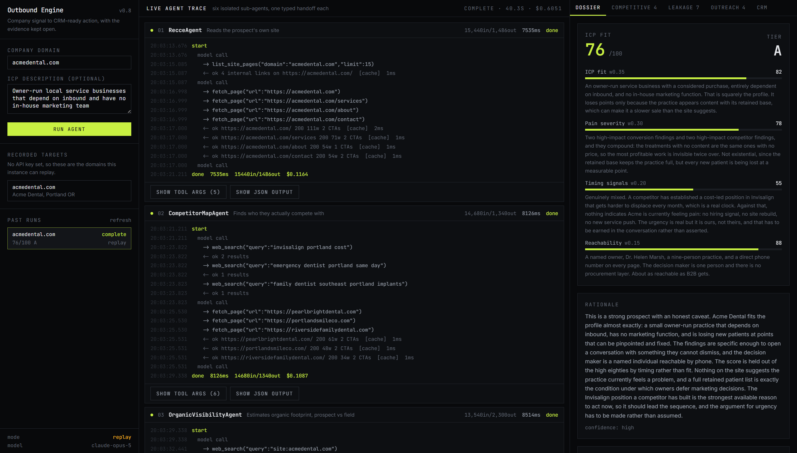
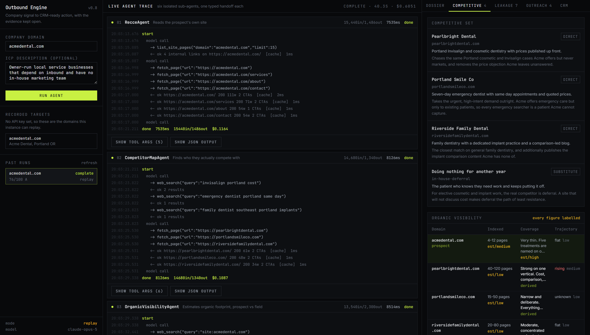
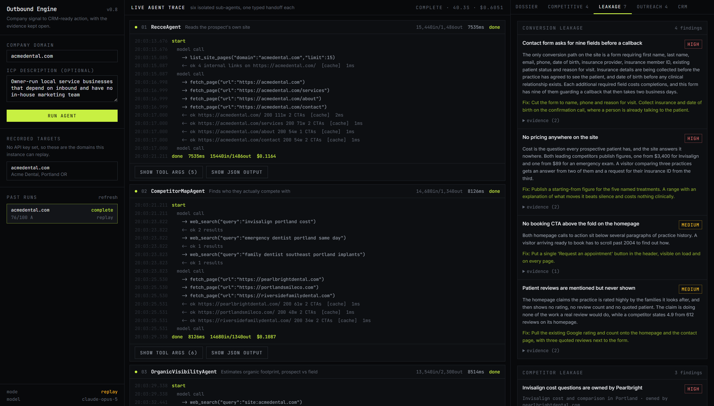
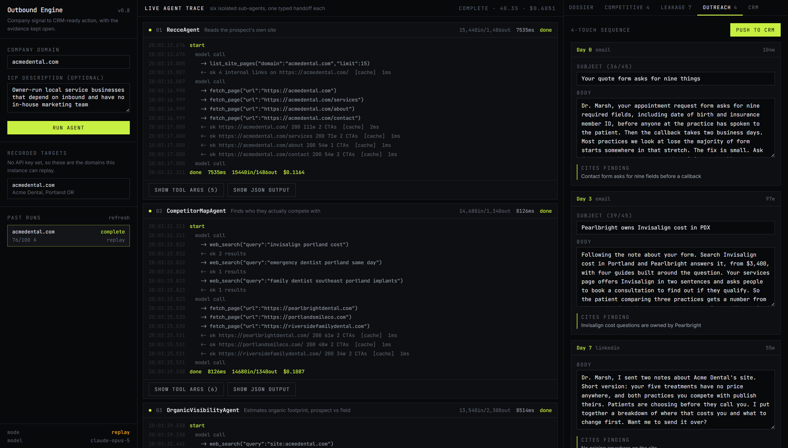
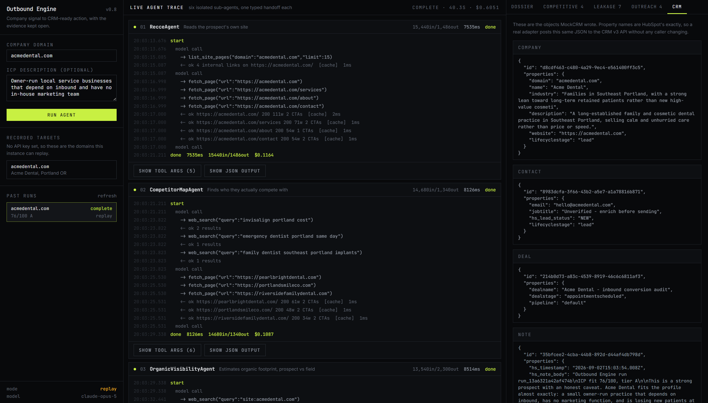

# Outbound Engine

An autonomous B2B prospect research and outreach agent. You give it a company
domain; it runs six isolated sub-agents from first page fetch to CRM-ready
action, streams every tool call and token to a live console, and hands back a
scored dossier, a competitive read, a leakage report and a four-touch sequence.

**It runs with no API key.** Clone, install, `npm run dev`. A completed run is
already there on first load, and clicking the recorded target streams the whole
pipeline again at its original pace, with the tool calls really executing
against a cached copy of the pages. Set `ANTHROPIC_API_KEY` and the same
pipeline runs live against any domain.

```bash
npm install
npm run dev      # localhost:3000, already seeded with a completed run
```

---

## What it looks like

The centre column is the point. Six sub-agents, each its own model call, streaming
nested tool calls with timestamps, cache hits, per-agent duration, tokens and cost.



Scoring weights live in `config/scoring.ts` and the weighting is applied in code, so
the breakdown always reconciles with the headline number.

**Competitive** — every figure carries its basis and confidence. Nothing here is a
bare number: `est/medium` and `derived` are enforced by the schema, not the prompt.



**Leakage** — conversion leakage on their own funnel, competitor leakage where a rival
owns an intent cluster, each with evidence, an impact rating and a specific fix.



**Outreach** — four touches, editable before they go anywhere, each citing a finding
this run actually produced. Subject length and word count are enforced by the schema.



**CRM** — the exact payloads written, with HubSpot property names. Shown raw so the
"a real adapter is a drop-in swap" claim is checkable rather than asserted.



---

## What this is, honestly

This is a **production-shaped demo**, not production infrastructure. The
architecture, the agent contract, the streaming trace, the error isolation and
the evidence rules are all real and all load-bearing. The three integrations
are mocks that write to SQLite, clearly marked, with the swap path documented
below. Nothing sends an email or touches a real CRM.

The parts worth reviewing as engineering rather than as a demo:

- **Sub-agent isolation is structural, not conventional.** Each agent builds a
  fresh message array and receives only the previous agent's typed output.
  There is no shared context object to leak from.
- **The no-fabricated-metrics rule lives in the type system.** An agent
  literally cannot emit an unsourced number; Zod rejects it and the validation
  error is fed back to the model. See [Evidence rules](#evidence-rules).
- **The copy rules are enforced the same way.** Em-dashes, banned openers,
  subject length, word count, and "every touch cites a finding that actually
  exists in this run" are all schema refinements, not prompt requests.
- **A failed sub-agent degrades the run instead of killing it**, and a step
  whose dependency is missing is skipped with a stated reason rather than fed a
  null and asked to improvise.

---

## Architecture

```
                                  ┌──────────────────────────────────────┐
  domain + ICP  ───────────────▶  │  app/api/run/route.ts                │
                                  │  opens an SSE stream immediately     │
                                  └──────────────────┬───────────────────┘
                                                     │ emit(TraceEvent)
                                  ┌──────────────────▼───────────────────┐
                                  │  lib/orchestrator.ts                 │
                                  │  typed sequential graph              │
                                  │  timing · cost · error isolation     │
                                  └──────────────────┬───────────────────┘
                                                     │
   ┌──────────────┬──────────────┬──────────────┬────┴─────────┬──────────────┐
   ▼              ▼              ▼              ▼              ▼              ▼
┌────────┐   ┌──────────┐   ┌──────────┐   ┌─────────┐   ┌─────────┐   ┌────────┐
│ Recce  │──▶│Competitor│──▶│ Organic  │──▶│ Leakage │──▶│ Scoring │──▶│  Copy  │
│        │   │   Map    │   │Visibility│   │         │   │         │   │        │
└────────┘   └──────────┘   └──────────┘   └─────────┘   └─────────┘   └────────┘
 Recce        Competitor     Organic         Leakage      Scoring       Copy
 Output   ──▶ MapOutput  ──▶ Visibility  ──▶ Output   ──▶ Output    ──▶ Output
              (typed handoff, and nothing else, between each pair)

   every agent runs through the SAME loop:
   ┌──────────────────────────────────────────────────────────────────────┐
   │  lib/agents/runtime.ts                                               │
   │    fresh message array  →  provider call  →  tool loop               │
   │      →  parse JSON  →  Zod validate                                  │
   │      →  on failure: feed the ZodError back, retry ONCE               │
   └───────────────────────────────┬──────────────────────────────────────┘
                                   │
                    ┌──────────────▼──────────────┐
                    │  lib/provider/  (the seam)  │
                    ├──────────────┬──────────────┤
                    │   live.ts    │  replay.ts   │
                    │ Anthropic    │  recorded    │
                    │ Messages API │  fixtures    │
                    └──────────────┴──────────────┘
                        key set        no key

   ┌─────────────────────────────────────────────────────────────────────┐
   │  lib/tools/registry.ts    one definition, three consumers           │
   ├──────────────────┬─────────────────────┬────────────────────────────┤
   │ toAnthropicTools │  mcp/server.ts      │  agent-sdk/sdk-run.ts      │
   │ in-process       │  stdio MCP          │  Agent SDK via that MCP    │
   └──────────────────┴─────────────────────┴────────────────────────────┘

   ┌─────────────────────────────────────────────────────────────────────┐
   │  lib/integrations/   MockCRM · MockEmail · MockCalendar → SQLite    │
   │  HubSpot / SendGrid / Cal.com shaped. Swap points documented below. │
   └─────────────────────────────────────────────────────────────────────┘
```

---

## The sub-agent contract

Every sub-agent satisfies one interface:

```ts
type SubAgent<TIn, TOut> = {
  name: string;
  description: string;
  tools: Tool[];                 // Anthropic tool definitions
  systemPrompt: string;
  outputSchema: ZodSchema<TOut>;
  run(input: TIn, emit: (e: TraceEvent) => void): Promise<TOut>;
};
```

In practice an agent module declares an `AgentSpec` — the same fields plus
`effort`, `maxTokens` and a `buildUserMessage(input)` — and `createAgent()`
supplies `run` from the shared runtime. Agent files are therefore almost
entirely data: a schema and a system prompt. Adding a seventh agent means
writing one spec, not another loop.

**The isolation rule.** `lib/agents/runtime.ts` constructs
`messages: [{ role: "user", content: spec.buildUserMessage(input) }]` at the
top of every execution. Nothing else is ever in scope. An agent cannot see
another agent's transcript because there is no transcript to see — only the
typed object the orchestrator passed it. There is a test for this
(`tests/runtime.test.ts`, "does not share a message array between agents").

**The retry.** On a schema failure the Zod issues are flattened into
actionable lines and sent back as a user turn. One repair attempt, then the
agent fails and the run degrades. `schema_retry` is a first-class trace event,
so repairs are visible in the console rather than hidden.

### The six

| # | Agent | Reads | Produces |
|---|-------|-------|----------|
| 1 | `RecceAgent` | homepage + up to 5 internal pages, `fetch_page`, `web_search` | positioning, services, target market, pricing signals, tech stack, CTA density |
| 2 | `CompetitorMapAgent` | recce output + search | 3–4 competitors with domain, one-liner, why they compete, overlap type |
| 3 | `OrganicVisibilityAgent` | recce + competitors + search | indexed volume, topical coverage, freshness, ranking trajectory — per domain, every figure labelled |
| 4 | `LeakageAgent` | everything above | conversion leakage (their funnel) + competitor leakage (themes rivals own) |
| 5 | `ScoringAgent` | everything above | four component scores 0–100 + rationale. **The weighting is done in code**, not by the model |
| 6 | `CopyAgent` | recce + leakage + score | 4 touches, days 0/3/7/12, each citing a real finding by name |

---

## Evidence rules

The brief said "do not invent metrics". Prompts are a weak place to enforce
that, so it is enforced in `lib/evidence.ts`:

```ts
{ label, kind: "exact",       value,            basis, confidence, evidence[] }
{ label, kind: "range",       low, high, unit,  basis, confidence, evidence[] }
{ label, kind: "qualitative", value,            basis, confidence, evidence[] }
```

Two rules are checked at parse time:

1. `kind: "exact"` requires `basis: "derived"` — a precise number is only
   allowed if it came from a page we fetched or a search result we saw.
2. `basis: "estimated"` can never be `kind: "exact"` — estimates are ranges or
   qualitative bands. No false precision.

So an agent that tries to emit `{ kind: "exact", value: 12400, basis: "estimated" }`
for "monthly organic traffic" fails validation, is told exactly why, and has to
restate it as a range or drop it. Every metric also requires at least one
`{ source, excerpt }`, and the UI renders that provenance next to the number
rather than hiding it.

`tests/evidence.test.ts` covers this directly.

---

## Swapping the mocks

Each adapter file opens with a comment naming its replacement. All three are
interfaces with a single SQLite-backed implementation; callers depend on the
interface only.

### `lib/integrations/crm.ts` → HubSpot

`MockCRM` already builds HubSpot's exact property names — `dealname`,
`dealstage`, `pipeline`, `numberofemployees`, `hs_lead_status`, `hs_note_body`,
`hs_timestamp`, `lifecyclestage`. The `properties` object it writes to SQLite
is the `properties` object HubSpot's v3 API expects. To go live:

```ts
class HubSpotCRM implements CRMAdapter {
  async upsertCompany(input) {
    const res = await fetch("https://api.hubapi.com/crm/v3/objects/companies", {
      method: "POST",
      headers: { authorization: `Bearer ${token}`, "content-type": "application/json" },
      body: JSON.stringify({ properties: buildCompanyProperties(input) }),
    });
    return res.json();
  }
  // ...
}
```

Then `setCrm(new HubSpotCRM(token))` at startup. No caller changes. The CRM tab
in the UI shows the raw payloads specifically so you can check this claim
before trusting it.

### `lib/integrations/email.ts` → SendGrid / Resend

`EmailAdapter` is `send()` and `schedule()`. `MockEmail` writes to the
`email_outbox` table. A real adapter posts to the provider and stores the
returned message id. Scheduling maps to the provider's `send_at`.

### `lib/integrations/calendar.ts` → Cal.com / Calendly

`CalendarAdapter.proposeSlots()` returns three slots and a booking URL. The real
version queries availability instead of computing business hours. Same
signature.

### Enrichment (not yet mocked)

`app/api/crm/push/route.ts` derives a role address from the domain rather than
inventing a person, and marks the contact `"Unverified - enrich before sending"`.
That block is the single place an Apollo or Clay call belongs.

---

## Path to Claude Code / Agent SDK

The brief asked for this as a README section. It is shipped instead, so you can
run it.

`lib/tools/registry.ts` defines each tool once — a Zod shape and a handler.
Three adapters sit over it:

| Consumer | How it reaches the tools |
|---|---|
| in-process sub-agents | `toAnthropicTools()` → Anthropic tool definitions |
| `mcp/server.ts` | the same Zod shapes registered on an MCP stdio server |
| `agent-sdk/sdk-run.ts` | the Agent SDK, with that MCP server attached |

Two headless entrypoints:

```bash
npm run agent -- acmedental.com          # the deterministic graph, no UI, works offline
npm run agent:sdk -- acmedental.com      # the same six agents on the Claude Agent SDK
npm run mcp                              # the tools alone, over stdio MCP
```

`agent-sdk/run.ts` proves the orchestration graph is independent of its UI: the
web console and the CLI are two consumers of one emitter, and the CLI runs with
no API key.

`agent-sdk/sdk-run.ts` is the migration itself:

```
                    run.ts                      sdk-run.ts
 orchestration      lib/orchestrator.ts         Agent SDK harness
 sub-agents         AgentSpec + runtime.ts      AgentDefinition
 tools              in-process registry         mcp/server.ts over stdio
 system prompts     ---------------- identical ----------------
 output contracts   ---------------- identical ----------------
```

The system prompts are not copied, they are *imported from the same modules*.
Only the harness and the transport change. That is the claim, and it is
checkable by reading forty lines of `sdk-run.ts`.

To use the tools from Claude Code directly:

```bash
claude mcp add outbound-engine -- npx tsx mcp/server.ts
```

---

## Live mode

```bash
export ANTHROPIC_API_KEY=sk-ant-...
export ANTHROPIC_MODEL=claude-opus-5   # optional; claude-sonnet-5 is the cheaper swap
npm run dev
```

With a key, `resolveProvider()` returns `LiveProvider` and any domain works.
Without one it returns `ReplayProvider` for recorded domains, and an explicit
error naming the recorded domains for anything else — it never fabricates a
run to cover for a missing key.

Notes on the live path, since two of these are easy to get wrong:

- **Assistant prefill is rejected on current models**, so the usual "prefill `{`
  to force JSON" trick 400s. The JSON contract is carried by the system prompt
  and enforced by Zod plus the repair retry.
- **Thinking is `{ type: "adaptive" }`**; `budget_tokens` is removed on current
  models and returns a 400. Depth is controlled per agent with
  `output_config.effort`.
- Each agent's system prompt is marked `cache_control: ephemeral`. The prompts
  are long and byte-stable, so re-runs read them at ~0.1× input cost.
- `fetch_page` results are cached in SQLite by URL, which is what keeps a warm
  run inside the 90s budget. The recorded run completes in ~40s.

---

## Recording a new fixture

Fixtures are TypeScript, not JSON, so the compiler checks a recording against
the live agent schemas. `fixtures/acmedental.ts` is the worked example:

1. Capture the pages you want available offline into `pages: RecordedPage[]`.
   They are replayed through the same cheerio extractor a live fetch uses, so
   the structural signals in a replayed trace are genuinely derived.
2. Declare each agent's final output as its real type
   (`const recceOutput: RecceOutput = {...}`). Wrong shape, build fails.
3. List the turns: `searches` for server-side web search, `toolCalls` for
   client tools (really executed on replay), `final` for the answer.
4. Add it to `RECORDED_RUNS` in `fixtures/index.ts`.

`tests/fixtures.test.ts` parses every recording through the real Zod schemas
including refinements, checks that every recorded tool exists, and checks that
every URL a recorded tool call fetches is primed — so a fixture that would hit
the network during a replay fails the suite instead of the demo.

---

## Layout

```
app/
  api/run/route.ts          SSE stream; headers out before agent one starts
  api/runs/[id]/route.ts    reopen a past run from persisted trace events
  api/crm/push/route.ts     the write side: company, contact, deal, note, sequence, slots
  page.tsx                  server component; reads run history for first paint
components/
  console.tsx               SSE consumption, three-column shell
  state.ts                  pure reducer over TraceEvent
  trace.tsx                 the agent cards
  artifacts.tsx             Dossier / Competitive / Leakage / Outreach / CRM
lib/
  agents/                   contract.ts, runtime.ts, and one file per sub-agent
  provider/                 the live/replay seam
  tools/                    registry.ts (one definition, three consumers), fetch-page.ts
  integrations/             crm.ts, email.ts, calendar.ts - all mocked, all marked
  db/                       schema.sql + typed accessors
  orchestrator.ts           the graph
  evidence.ts               the metric type that makes fabrication a parse error
config/scoring.ts           tunable weights and tier thresholds
fixtures/                   recorded runs
mcp/server.ts               tools over stdio MCP
agent-sdk/                  run.ts (headless graph) · sdk-run.ts (Agent SDK)
tests/                      30 tests, fully offline
```

## Commands

```bash
npm run dev          # console at localhost:3000, seeded on first request
npm run snapshot     # re-capture the seeded run from a live pipeline pass
npm run agent        # headless pipeline
npm run agent:sdk    # Agent SDK + MCP variant (needs credentials)
npm run mcp          # MCP server on stdio
npm test             # 30 tests, no network, no API key
npm run typecheck    # strict, no `any`
```

## Deliberately not built

Auth, multi-tenancy, billing, a dashboard shell, settings pages. The brief
excluded them and they would have diluted the part that matters.
